# 🛒 SMARTCART: RFID SMART BILLING SYSTEM

This project is an embedded system developed using a **microcontroller-based design** that enables automatic billing using **RFID technology**.  
It simplifies shopping by eliminating manual billing and reducing checkout time.

## ✨ Features

- RFID-based product identification  
- Automatic cart billing system  
- Real-time total price calculation  
- Manager mode for updating products  
- Product add/remove functionality  
- LCD display for user interaction  
- Keypad-based input for payment  
- Secure card payment with PIN verification  
- UART communication to display data on PC  

## 💻 Hardware Used

- Microcontroller (ARM / Embedded Controller)  
- RFID Reader & RFID Tags  
- 16x2 LCD Display  
- Keypad  
- Buzzer  
- UART (Serial Communication Interface)  
- PC for product monitoring  

## ⏳ How It Works

1. System starts and displays a welcome message.  
2. User scans RFID card (Manager/Product).  
3. Manager can update product details in database.  
4. User scans product tags to add items to cart.  
5. System displays product price and updates total bill.  
6. User can delete items using RFID scan.  
7. Cart details are sent to PC via UART.  
8. User selects payment mode using keypad.  
9. For card payment, user enters PIN.  
10. If PIN is correct → transaction successful.  
11. System displays “Thank You” message.  

---

## 🌄 Project Images

### ⏺️ Block Diagram
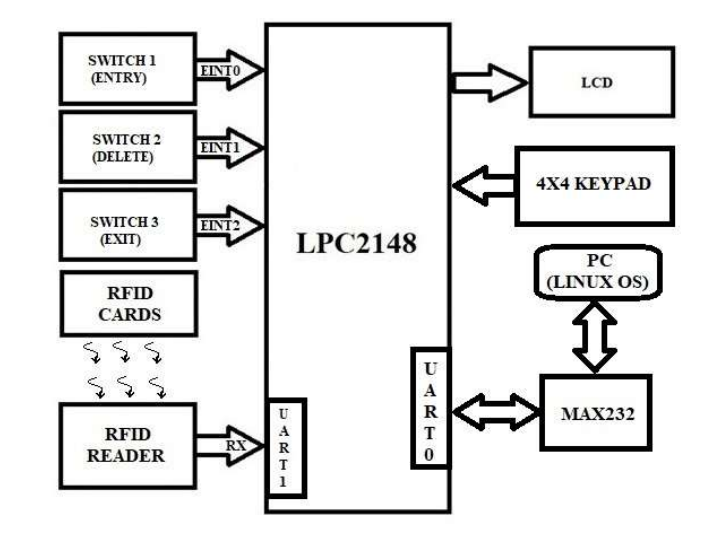

---

### 🔌 Circuit Schematic
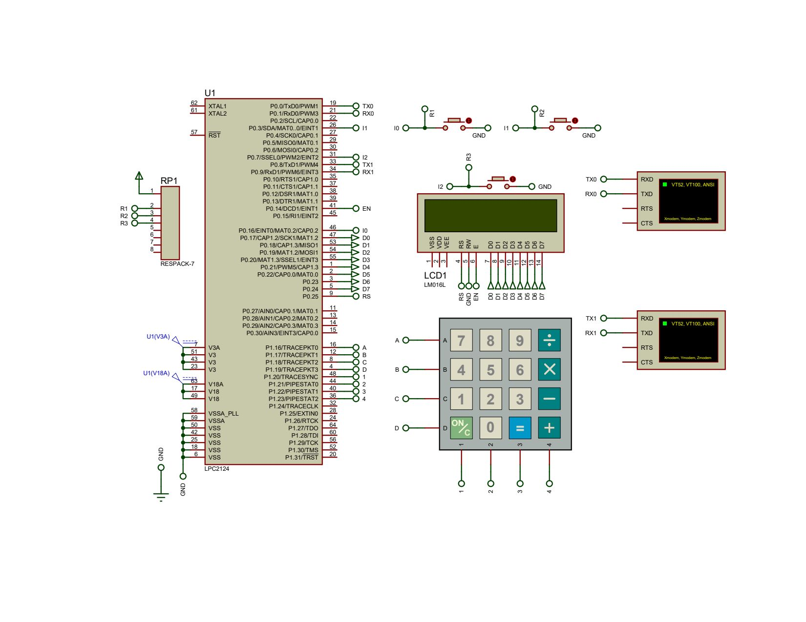

---

### ▶️ Welcome Screen
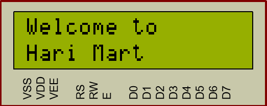

---

### 🔍 Scan Selection (Manager/Product)
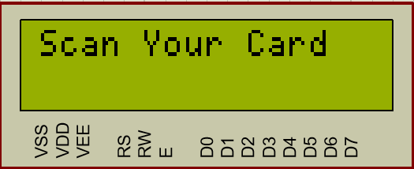

---

### ⚙️ Manager Updating Products
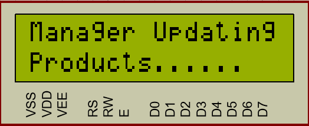

---

### ✅ Product Update Success
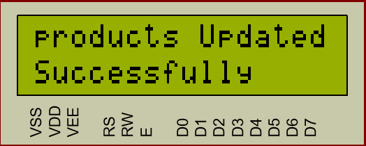

---

### 💰 Product Price & Total Bill

---

### 🖥️ Product List on PC
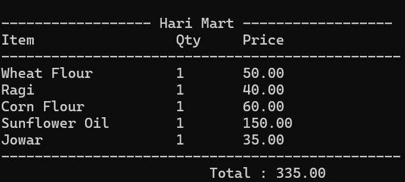

---

### ❌ Scan to Delete Product
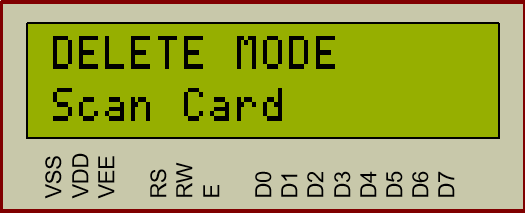

---

### 💸 Updated Price After Deletion
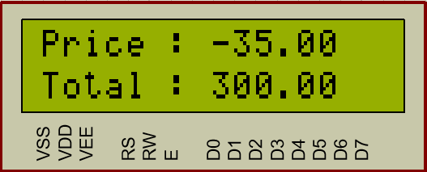

---

### 🖥️ Updated Product List on PC
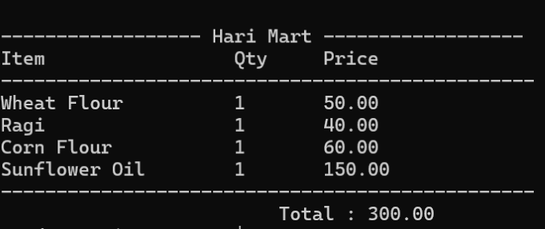

---

### 💳 Payment Mode Selection
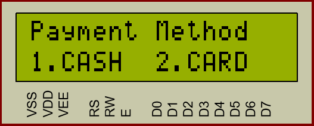

---

### 🔢 Enter Amount
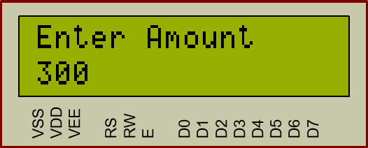

---

### 💳 Swipe Card
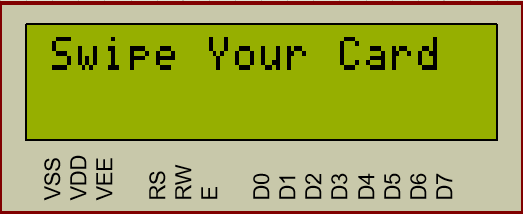

---

### ❗ Wrong PIN
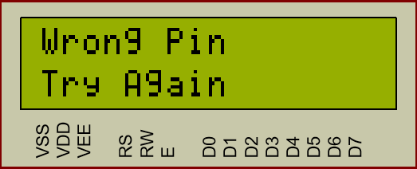

---

### 🎉 Transaction Success
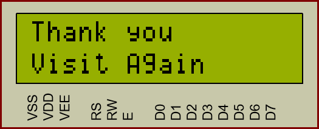

---

## 👨🏻‍💻 Author

**J Bhargava Satish**

## 🌄 Project Images

### ⏺️ Block Diagram

---

### 🔌 Circuit Schematic

---

### ▶️ Welcome Screen

---

### 🔍 Scan Selection (Manager/Product)

---

### ⚙️ Manager Updating Products

---

### ✅ Product Update Success

---

### 💰 Product Price & Total Bill

---

### 🖥️ Product List on PC

---

### ❌ Scan to Delete Product

---

### 💸 Updated Price After Deletion

---

### 🖥️ Updated Product List on PC

---

### 💳 Payment Mode Selection

---

### 🔢 Enter Amount

---

### 💳 Swipe Card

---

### ❗ Wrong PIN

---

### 🎉 Transaction Success

